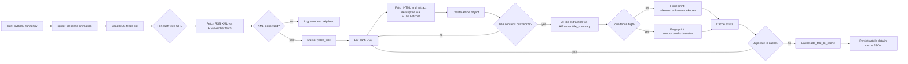

## Mermaid diagrams VSCode

```mermaid
flowchart LR
    A[Run: python3 runner.py] --> B[spider_descend animation]
    B --> C[Load RSS feeds list]
    C --> D{For each feed URL}
    D --> E[Fetch RSS XML via RSSFetcher.fetch]
    E --> F{XML looks valid?}
    F -- no --> F1[Log error and skip feed]
    F -- yes --> G[Parser.parse_xml]
    G --> H[For each RSS <item>]
    H --> I[Fetch HTML and extract description via HTMLFetcher]
    I --> J[Create Article object]
    J --> K{Title contains buzzwords?}
    K -- no --> H
    K -- yes --> L[AI title extraction via AIRunner.title_summary]
    L --> M{Confidence high?}
    M -- no --> N[Fingerprint: unknown:unknown:unknown]
    M -- yes --> O[Fingerprint: vendor:product:version]
    N --> P[Cache.exists]
    O --> P
    P --> Q{Duplicate in cache?}
    Q -- yes --> H
    Q -- no --> R[Cache.add_title_to_cache]
    R --> S[Persist article data in cache JSON]
```